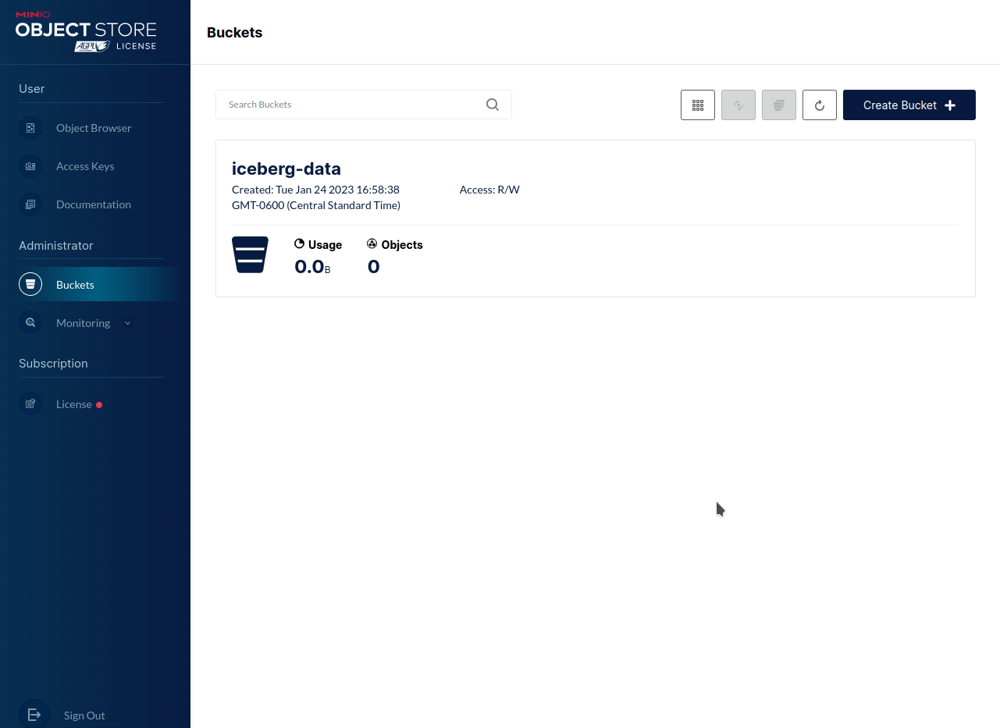

# iceberg-intro-workshop

---

## Objective:

 * To stand up an environment to evaluate Apache Iceberg with data stored in an S3a service (minio) on a traditional server.

---

###  Pre-Requisites:

 * I built this on a new install of Ubuntu Server
 * Version: 20.04.5 LTS 
 * Instance Specs: (min 2 core w/ 4 GB ram)

---

##  Install Git tools and pull the repo
*  ssh into your new Ubuntu 20.04 instance and run the below command:

---

```
sudo apt-get install git-all -y

cd ~
git clone https://github.com/tlepple/iceberg-intro-workshop.git
```

---


## Start the build:

####  This script will setup and confgure the following tools on this one host:
 - minio (local S3a Service) (RELEASE.2023-01-12T02-06-16Z )
 - minio cli  (version RELEASE.2023-01-11T03-14-16Z )
 - openjdk 11 (version: 11 )
 - aws cli (version 2.19.19)
 - postgresql (version: 14)
 - apache spark (version: 3.3_2.12)
 - apache iceberg (version 1.1.0)

---

```
#  run it:
. ~/iceberg-intro-workshop/setup_iceberg.sh
```
 * Grab a coffee, this will run a while.

---
## Let's Explore Minio

Let's login into the minio GUI: navigate to `http:\\<host ip address>:9000` in a browser

  - Username: `icebergadmin`
  - Password: `supersecret1!`

---

---

This is the view of the Object Browser with one bucket that was created with the script `iceberg-data`
---


---
Click on the tab `Access Keys` :  That key was created during the build script too.
---

---
Click on the table `Buckets` 
---


---
## Start a standalone Spark Master Server 

```
cd $SPARK_HOME

. ./sbin/start-master.sh
```

---

## Start a Spark Worker Server 

```
. ./sbin/start-worker.sh spark://$(hostname -f):7077
```

---

##  Check that the Spark GUI is up:
 * navigate to `http:\\<host ip address>:8080` in a browser

---

###  Initialize some variables that will be used when we start the Spark-SQL service

```
. ~/minio-output.properties

export AWS_ACCESS_KEY_ID=$access_key
export AWS_SECRET_ACCESS_KEY=$secret_key
export AWS_S3_ENDPOINT=127.0.0.1:9000
export AWS_REGION=us-east-1
export MINIO_REGION=us-east-1
export DEPENDENCIES="org.apache.iceberg:iceberg-spark-runtime-3.3_2.12:1.1.0"
export AWS_SDK_VERSION=2.19.19
export AWS_MAVEN_GROUP=software.amazon.awssdk
export AWS_PACKAGES=(
"bundle"
"url-connection-client"
)
for pkg in "${AWS_PACKAGES[@]}"; do
export DEPENDENCIES+=",$AWS_MAVEN_GROUP:$pkg:$AWS_SDK_VERSION"
done
```

###  Start the Spark-SQL client service:

```
cd $SPARK_HOME

spark-sql --packages $DEPENDENCIES \
--conf spark.sql.extensions=org.apache.iceberg.spark.extensions.IcebergSparkSessionExtensions \
--conf spark.sql.catalog.icecatalog=org.apache.iceberg.spark.SparkCatalog \
--conf spark.sql.catalog.icecatalog.catalog-impl=org.apache.iceberg.jdbc.JdbcCatalog \
--conf spark.sql.catalog.icecatalog.uri=jdbc:postgresql://127.0.0.1:5432/icecatalog \
--conf spark.sql.catalog.icecatalog.jdbc.user=icecatalog \
--conf spark.sql.catalog.icecatalog.jdbc.password=supersecret1 \
--conf spark.sql.catalog.icecatalog.warehouse=s3://iceberg-data \
--conf spark.sql.catalog.icecatalog.io-impl=org.apache.iceberg.aws.s3.S3FileIO \
--conf spark.sql.catalog.icecatalog.s3.endpoint=http://127.0.0.1:9000 \
--conf spark.sql.catalog.sparkcatalog=org.apache.iceberg.spark.SparkSessionCatalog \
--conf spark.sql.defaultCatalog=icecatalog \
--conf spark.eventLog.enabled=true \
--conf spark.eventLog.dir=/opt/spark/spark-events \
--conf spark.history.fs.logDirectory=/opt/spark/spark-events \
--conf spark.sql.catalogImplementation=in-memory
```

---

###  Let's do a cursory check

```
SHOW CURRENT NAMESPACE;
```

#### Expected Output:

```
icecatalog
Time taken: 2.692 seconds, Fetched 1 row(s)
```

